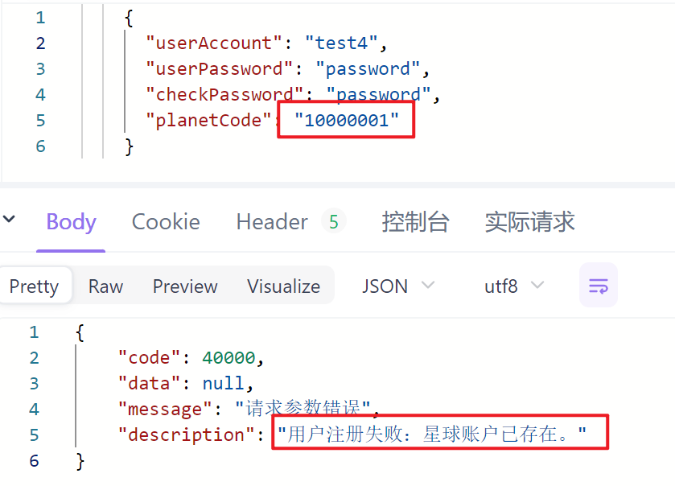

一份由 Spring Boot + MyBatis-Plus 构建的现代化、轻量级的用户中心后端服务，提供完整的用户注册、登录及管理功能。

## ✨ 项目简介

本项目是一个功能完善的后端服务，旨在为所有需要用户系统的应用提供统一、可靠的用户管理解决方案。其核心功能包括：

*   **用户注册**：支持新用户创建账户。
*   **用户登录**：通过会话（Session）机制维护用户登录态。
*   **用户登出**：清理用户登录状态。
*   **用户查询**：管理员可根据用户名模糊搜索用户。
*   **用户删除**：管理员可对用户进行逻辑删除。
*   **信息获取**：用户可以获取自己当前的（已脱敏的）信息。

## 🚀 技术选型

| 技术         | 名称与版本                         | 说明                          |
| ---------- | ----------------------------- | --------------------------- |
| **核心框架**   | Spring Boot 3.3.1             | 项目基础框架                      |
| **编程语言**   | Java 17                       | 长期支持（LTS）版本                 |
| **数据持久层**  | MyBatis-Plus 3.5.7            | 简化 CRUD 操作，支持 Spring Boot 3 |
| **数据库**    | MySQL 8.0                     | 关系型数据库                      |
| **构建工具**   | Maven                         | 项目依赖与构建管理                   |
| **Web服务器** | Tomcat (Spring Boot 内嵌)       | -                           |
| **工具库**    | Lombok, Apache Commons Lang 3 | 简化代码，提高开发效率                 |

## ⚡️ 快速启动

请遵循以下步骤在本地环境中快速部署和运行本项目。

### 1. 环境准备

请确保您的本地已安装以下环境：

*   JDK 17
*   Maven 3.6+
*   MySQL 8.0+

### 2. 克隆项目

```bash
git clone <your-repository-url>
cd user_center
```

### 3. 数据库初始化

请连接到您的 MySQL 数据库，并执行以下 SQL 脚本以创建 `user` 表。

```sql
-- 创建数据库（如果不存在）
CREATE DATABASE IF NOT EXISTS test1;
USE test1;

-- 创建 user 表
CREATE TABLE test1.user
(
    id           BIGINT AUTO_INCREMENT PRIMARY KEY,
    username     VARCHAR(256)                       NULL COMMENT '用户昵称',
    userAccount  VARCHAR(256)                       NULL COMMENT '账号',
    avatarUrl    VARCHAR(1024)                      NULL COMMENT '用户头像',
    gender       TINYINT                            NULL COMMENT '性别',
    userPassword VARCHAR(512)                       NOT NULL COMMENT '密码',
    email        VARCHAR(512)                       NULL COMMENT '邮箱',
    userStatus   INT      DEFAULT 0                 NULL COMMENT '状态 0-正常',
    phone        VARCHAR(128)                       NULL COMMENT '电话',
    createTime   DATETIME DEFAULT CURRENT_TIMESTAMP NULL COMMENT '创建时间',
    updateTime   DATETIME DEFAULT CURRENT_TIMESTAMP NULL ON UPDATE CURRENT_TIMESTAMP COMMENT '更新时间',
    isDelete     TINYINT  DEFAULT 0                 NOT NULL COMMENT '是否删除 (0-未删, 1-已删)',
    userRole     INT      DEFAULT 0                 NOT NULL COMMENT '用户角色 (0-普通用户, 1-管理员)',
    planetCode   VARCHAR(512)                       NULL COMMENT '星球编号'
) COMMENT '用户表';
```

### 4. 修改配置

在 `src/main/resources/` 目录下，创建 `application.yml` 文件，并将以下内容复制进去。

**请务必修改 `datasource` 部分的 `username` 和 `password` 为您自己的数据库凭据。**

```yaml
spring:
  application:
    name: user-center
  datasource:
    url: jdbc:mysql://localhost:3306/test1?useUnicode=true&characterEncoding=utf-8&serverTimezone=Asia/Shanghai
    username: root # <-- 修改为你的数据库用户名
    password: your_password # <-- 修改为你的数据库密码
# session 过期时间（单位：秒）
session:
  timeout: 86400
server:
  port: 8080

mybatis-plus:
  configuration:
    # 关键配置：数据库列名与实体类字段名均为驼峰，无需转换
    map-underscore-to-camel-case: false
  global-config:
    db-config:
      logic-delete-field: isDelete # 全局逻辑删除的实体字段名
      logic-delete-value: 1       # 逻辑已删除值 (默认为 1)
      logic-not-delete-value: 0   # 逻辑未删除值 (默认为 0)

```

### 5. 运行项目

打开终端，在项目根目录下执行以下 Maven 命令：

```bash
mvn spring-boot:run
```

当看到 Spring Boot 的启动日志后，表示项目已成功运行在 `http://localhost:8080`。

## 📁 项目结构

项目采用经典的分层架构，职责清晰，易于维护。

```
com.example.user_center
├── annotation/      # 自定义注解 (如 @AuthCheck)
├── aop/             # 切面编程 (如权限校验切面)
├── common/          # 通用工具类与常量 (如 BaseResponse, ErrorCode)
├── constant/        # 全局常量
├── controller/      # 接口层：处理 HTTP 请求，参数校验
├── exception/       # 全局异常处理
├── mapper/          # 数据访问层 (MyBatis-Plus Mapper 接口)
├── model/           # 数据模型
│   ├── domain/      # 数据库实体类 (User.java)
│   └── request/     # 请求体 DTO (UserRegisterRequest.java)
├── service/         # 业务逻辑层
│   ├── impl/        # 业务逻辑实现类
│   └── UserService.java # 业务接口
└── UserCenterApplication.java # Spring Boot 启动类
```

## 📖 API 接口文档

所有接口的基地址为: `http://localhost:8080/user`

### 通用响应格式

所有 API 成功时返回的数据都将包裹在以下 JSON 结构中：

```json
{
  "code": 0,
  "data": "...",
  "message": "ok",
  "description": ""
}
```

失败时，`code` 为非 0 值，`message` 和 `description` 将提供错误详情。

---

### 1. 用户注册

*   **Endpoint:** `POST /user/register`
*   **描述:** 创建一个新用户。
  *   **请求体 (Request Body):**
      ```json
       {
        "userAccount": "testAdmin",
        "userPassword": "password12345",
        "checkPassword": "password12345",
        "planetCode": "10000001"
      }
*   **成功响应 (Success Response):** data返回新用户的 `id`。

*   **失败响应用例1 (Error Response):**两次输入密码不一致

- **失败响应用例2 (Error Response):**输入参数存在空值
  
- **失败响应用例3 (Error Response):**账户长度太短
  
-  **失败响应用例4 (Error Response):**密码长度太短
   
- **失败响应用例5 (Error Response):**账户名包含特殊字符
  
- **失败响应用例6 (Error Response):**账户已存在
  
- **失败响应用例7 (Error Response):**星球账户已存在
  


---
### 2. 用户登录

*   **Endpoint:** `POST /login`
*   **描述:** 用户使用账号密码登录，成功后服务端会创建 Session。
*   **请求体 (Request Body):**
    ```json
    {
    "userAccount": "testAdmin",
    "userPassword": "password12345"
    }
    ```
*   **成功响应 (Success Response):** 返回已脱敏的用户信息。
    
*   **失败响应 (Error Response):** 密码输入错误
    
*   **失败响应 (Error Response):** 账户长度过短
    
*   **失败响应 (Error Response):** 密码长度过短
    
*   **失败响应 (Error Response):** 账户名包含特殊字符
    
---

### 3. 用户登出

*   **Endpoint:** `POST /logout`
*   **描述:** 清除服务端的登录 Session。
*   **请求体 (Request Body):** 无
*   **成功响应 (Success Response):**
    


---

### 4. 获取当前登录用户信息

*   **Endpoint:** `GET /current`
*   **描述:** 获取当前已登录的用户信息（已脱敏）。
*   **请求体 (Request Body):** 无
*   **成功响应 (Success Response):**
    
*   **失败响应 (Error Response):** 如果未登录。
---

### 5. 搜索用户（管理员权限）

*   **Endpoint:** `GET /search`
*   **描述:** **此接口仅限管理员调用**。根据用户账户模糊查询用户列表。
*   **查询参数 (Query Parameters):**
    *   `userAccount` (string, 可选): 用户昵称关键词。
*   **请求示例:** `GET http://localhost:8080/user/search?userAccount=user`
*   **成功响应 (Success Response):** 返回用户列表（已脱敏）。
    
*   **失败响应 (Error Response):** 如果非管理员调用。
    
---

### 6. 删除用户（管理员权限）

*   **Endpoint:** `DELETE /delete/{id}`
*   **描述:** **此接口仅限管理员调用**。根据用户 ID 逻辑删除用户。
*   **路径参数 (Path Variables):**
    *   `id` (long, 必填): 要删除的用户 ID。
*   **请求示例:** `DELETE http://localhost:8080/user/delete/2`
*   **成功响应 (Success Response):** 返回操作是否成功。
    
*   **失败响应 (Error Response):** 如果 ID 不存在或无权限。
    

## ⚠️ 错误码列表

| Code  | Message | Description |
| ----- | ------- | ----------- |
| 0     | OK      | 成功          |
| 40000 | 请求参数错误  | 请求参数不符合要求   |
| 40001 | 请求数据为空  | POST 请求体为空  |
| 40100 | 未登录     | 需要登录后操作     |
| 40101 | 无权限     | 通常是管理员权限不足  |
| 50000 | 系统内部异常  | 服务器发生未知错误   |
